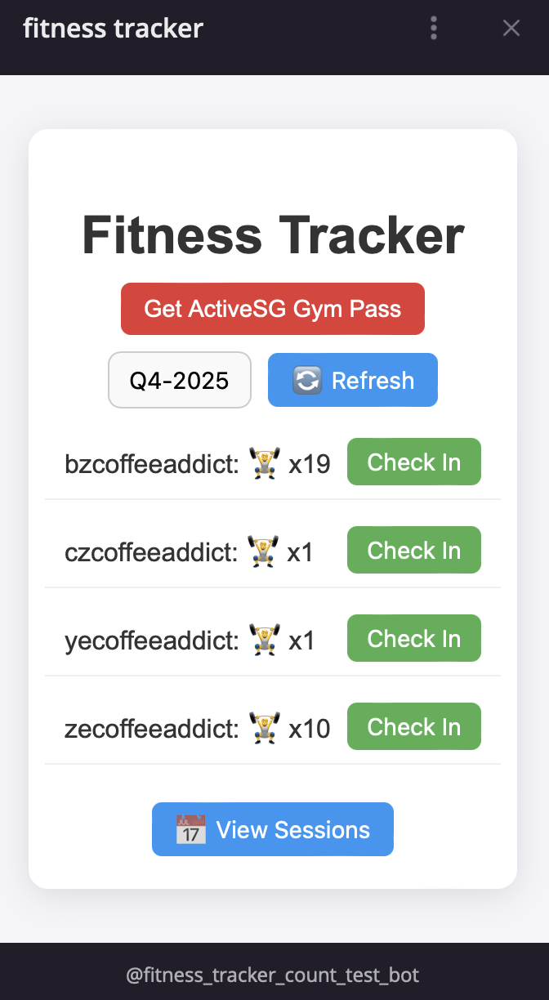
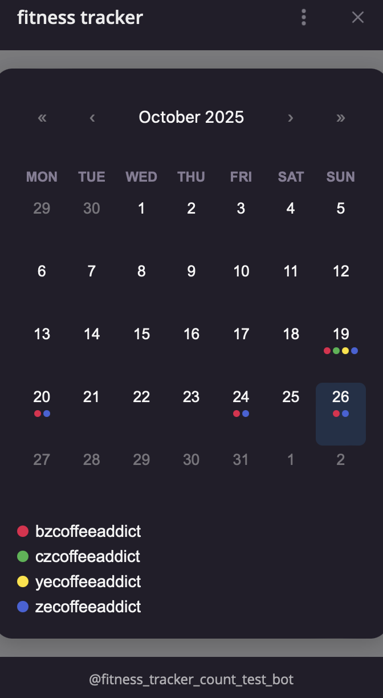

# Fitness Telegram Mini App

_a comprehensive guide to setup your own fitness bot to track fitness session counts with your friends!_

## Development

1. go to bot father in telgram app to create your a test bot and obtain `BOT_TOKEN` (copy into .env file)
2. setup mongoDB atlas + obtain `MONGO_URI` (copy into .env file)
3. name your test env table name as `MONGO_NAME` (copy into .env file)
4. configure `JWT_SECRET` as a random string, the more secure the better
5. make sure your mongoDB accepts inbound traffic from your local IP address for development
6. run `npm i` in both client and server directory
7. run `npm run build` in the client directory to prepare static files to be served
8. run `npm run start` in the server directory
9. run `sudo npx localtunnel --port 3000` in a separate terminal
10. enable mini app in your telegram bot and configure it with the link obtained in the previous step
11. enable mini app direct link
12. copy this direct link into any telegram group chat and open it from there

## Deployment

1. do Development steps #1 - #4 but for the LIVE env
2. setup AWS EC2 instance and enable inbound traffic from this EC2 instsance IP to mongoDB
3. do Development steps #6 - #7 in EC2
4. get a https domain (A record) from cloudflare which references the EC2 IP address
5. run `npm run build` in server directory
6. run `sudo npm run process:start` in server directory
7. enable mini app in your telegram bot and configure it with your https domain
8. do Development steps #11 - #12

## Conclusion and Things to Note

- now you have 2 bots, one in test and one in live (with the live one running 24/7)
- whenever you want to do some testing or changes you can play around with it in the test env using the test bot
- everytime changes are made in the client folder, you need to do `npm run build` in that directory to serve it in server
